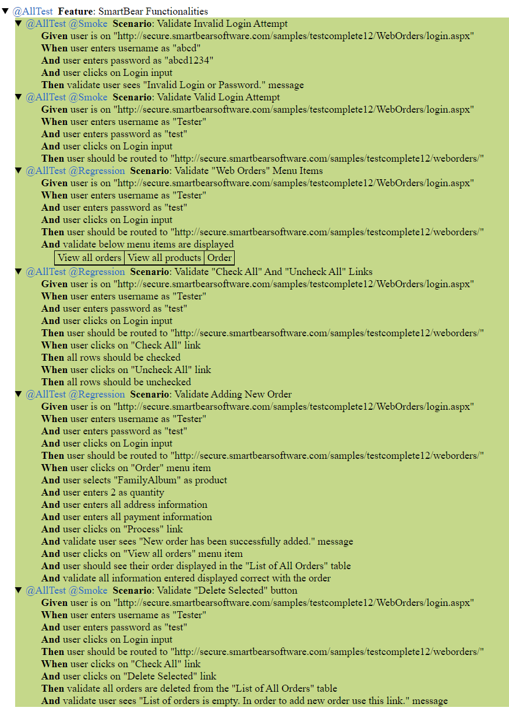

This repository consists of a sample testing framework with Cucumber.
The framework is based on:
    
    - Java JDK -> version: 8
    - Selenium -> version: 3.141.59
    - Cucumber-java and Cucumber-junit -> version: 4.20

NOTES:
    
    - ChromeDriver 103 has some instability issues with this framework configuration, Selenium version or overall driver incompatability issues. 
    - Forced testing to run on the more stable ChromeDriver 102 version to have tests pass much more consistently.
    - Framework tested with ChromeDriver, HTMLUnitDriver (headless) and FirefoxDriver.
    - Implements heavy ExpectedCondition, ExplicitWaits and StaleElementException handling. Refer to src/test/java/browser/utils/Waiter for more.

Test results running '@AllTest' with through maven command (screenshots enabled on failure only):
